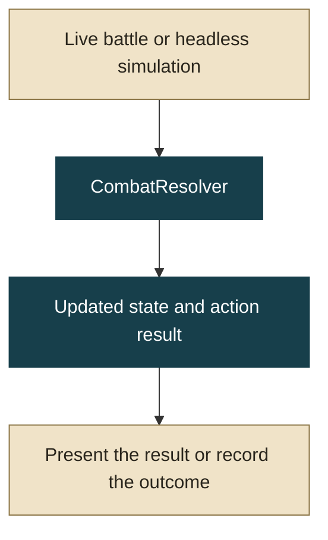
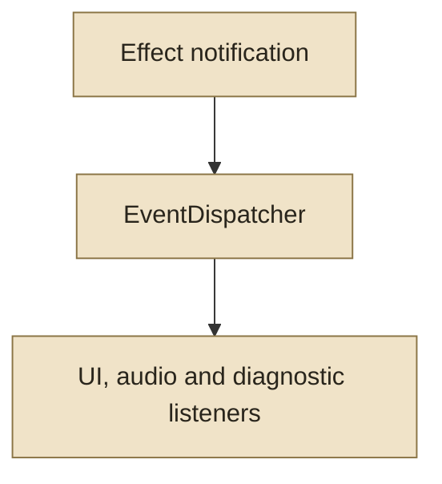

[← Project](README.md) · [See the development tools](https://lacrimaeaware.github.io/gojomons-portfolio/tools/)

# Many reactions. One combat result.

A hit can activate an item, a creature ability, an animation and a combat-log entry. As Gojomons grew, wiring each system directly to every other system made changes harder to follow. Automated balance testing raised a second requirement: a simulated battle must execute the same rules as a visible battle.

## Separate resolving an action from reacting to it

**Resolve the action once**



**Let other systems react**



Teal identifies combat rules and state. Gold identifies callers, presentation and observation. Both live play and simulation use the same resolver.

## Why I introduced signals

A central `EventDispatcher` and named `GameEvents` give systems a shared vocabulary. A producer announces an event; the UI, audio or diagnostics can respond without being imported into the producer. Campaign systems use the same approach for travel, shops and dungeon outcomes.

## Why signals were only part of the solution

Combat effects also need a definite execution order. Mixing event-driven mutation with direct simulator calls could apply an effect twice, or let the two paths diverge. I consolidated damage, statuses, bonus hits and queued healing in the shared `CombatResolver`. The live turn manager presents the result; the simulator records it without loading a visual scene.

| Responsibility | Owner | Reason |
| --- | --- | --- |
| Apply ordered combat changes | `CombatResolver` | One place determines the outcome |
| Announce effects and lifecycle events | `EventDispatcher` / `GameEvents` | Observers can evolve independently |
| Animate and play sound | Live presentation | Timing does not require a second resolution |
| Run repeated battles | `BattleSimulator` | Balance experiments exercise the shared rules |
| Attach and remove listeners | The owning scene or system | Temporary reactions end with their context |

<details>
<summary>Dispatcher implementation and lifecycle rules</summary>

The dispatcher rejects duplicate registration, removes empty event lists and copies the listener list before dispatch. A listener can therefore register or unregister during an event without changing the current iteration.

```gdscript
func emit(event_name: String, context: Dictionary) -> void:
    if not handlers.has(event_name):
        return
    var current: Array = Array(handlers[event_name]).duplicate()
    for handler in current:
        if handler is Callable:
            handler.call(context)
```

Authoritative combat mutation stays in the resolver. Live presentation consumes its output once. Scene listeners and temporary effects have explicit cleanup boundaries, and dispatch responds to events rather than per-frame polling.

</details>

The [balance experiment](METHODS.md) uses this shared combat path. The [tools chapter](https://lacrimaeaware.github.io/gojomons-portfolio/tools/) shows how individual encounters can be inspected during development.
