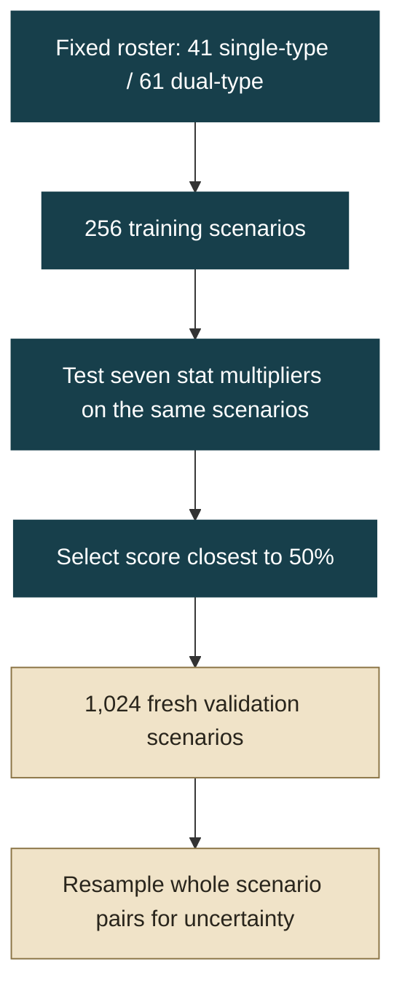

[← Project](README.md) · [Interactive balance showcase](https://lacrimaeaware.github.io/gojomons-portfolio/balance/)

# Testing whether a roster adjustment is needed

Creature types change which matchups and combinations are useful. Gojomons gives single-type creatures a 7% stat allowance to keep them competitive with dual-type creatures. This experiment asks whether changing that allowance improves average matchup balance.

## Decision and evidence

| Decision | Fresh-matchup result | Uncertainty |
| --- | --- | --- |
| **Retain current stats** | **49.7%** single-type battle score | **47.2–52.3%** paired-bootstrap 95% interval |

Training selected 1.00×: the existing allowance remains in place. Validation used 1,024 fresh scenarios, each fought on both sides. The result supports group-level parity for this roster and ruleset; equipment and campaign builds require their own tests.

## Select first, validate afterward



**Teal: choose the setting. Gold: evaluate it on fresh scenarios.** Each scenario exchanges the two sides, so placement is balanced within the pair.

## What changes, and what stays fixed

| Component | Setting |
| --- | --- |
| Eligible roster | Final-stage, nonlegendary species with one or two types |
| Level and styles | Level 30; one style realization per species, roster seed 741911 |
| Active mechanics | Level-dependent moves, family abilities and subtype effects |
| Equipment and environment | No held items, relics, master bonuses or weather |
| Intervention | Multiply single-type HP, attack, defenses and speed; round to nearest integer |
| Candidate multipliers | 0.80, 0.90, 1.00, 1.10, 1.20, 1.30, 1.40, relative to current stats |
| Battle score | Win = 1; loss = 0; draw or 80-turn timeout = ½ |
| Scenario score | Mean of its two side-swapped battle scores |

One species from each group is sampled uniformly with replacement, together with a battle seed. All settings use the same training scenarios. The setting closest to 50% wins; ascending grid order breaks ties. Since the baseline won selection, the holdout contains one condition.

## Why the pairing matters

The two orientations share a matchup and seed, so they are related observations. The bootstrap resamples **whole scenarios**, keeping each pair together, rather than counting 2,048 battles as independent. It uses 4,000 resamples and a fixed analysis seed.

| Validation measure | Recorded value |
| --- | --- |
| Battles | 2,048 |
| Draws / timeouts | 34 / 0 |
| Mean battle length | 5.30 turns |
| Conservative Hoeffding 95% interval | 45.5–54.0% |

Both intervals describe matchup-and-seed sampling within this fixed roster. Individual species, alternate combat styles and player strategies can produce different patterns. The intervention measures the effect of scaling stats, rather than isolating the effect of a second type.

<details>
<summary>Reproducibility checks and statistical details</summary>

Training contains 3,584 battles; validation adds 2,048, for 5,632 recorded battles.

| Check | Recorded outcome |
| --- | --- |
| Repeat fixed seeds | 32 battles reproduced |
| Reverse parameter order | First eight scenarios at each setting matched outcomes and turn counts, including a fresh engine process |
| Stat scaling survives initialization | Checked at 0.80× and 1.40× |
| Input mutation / effects pipeline | Harness checks input mutation and requires effects to be enabled |
| Multi-target regression | 600 seeds passed, including 98 primary misses |

Shared seeds couple comparisons, but changed actions can consume random draws differently. The trajectories need not share identical hit/miss events. Bootstrap intervals are approximate and pointwise. The convergence display also uses pointwise intervals, not a sequential stopping rule.

The stat multiplier includes current and maximum HP, Attack, Defense, Special Attack, Special Defense and Speed. It acts on effective combat stats after the existing 1.07 allowance.

</details>

## Reproduce the analysis

```sh
python experiments/analyze_balance.py
python -m unittest discover -s tests
```

[Individual outcomes](data/battle-outcomes.json) feed the [analysis script](experiments/analyze_balance.py), which regenerates the [summary](data/balance-summary.json). The private game source is needed to run new battles. [Provenance](PROVENANCE.md) records the engine and source snapshot.
