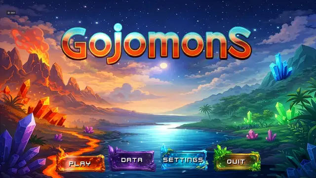

# Gojomons

Gojomons is a creature-building roguelike autobattler I am developing in Godot. Build a team, choose a route, combine moves with equipment, and find out whether the plan survives the next fight.

## Start with the game

[](https://lacrimaeaware.github.io/gojomons-portfolio/)

### **[Open the visual showcase →](https://lacrimaeaware.github.io/gojomons-portfolio/)**

The interactive showcase introduces the world, creatures and combat through game footage, then opens the development side: simulation-based balance work, repeatable playtests and the tools used to inspect results.

For a closer technical look:

- **[Architecture](ARCHITECTURE.md)** explains why the project uses a central event vocabulary alongside one shared combat resolver.
- **[Balance study](METHODS.md)** records the experimental design, controls and reproducible analysis behind one roster decision.
- **[Provenance](PROVENANCE.md)** identifies what the public data and media represent.

Runs move through towns, routes, dungeons and bosses. Creature families, moves, held items and team relics create builds that can behave very differently even when their basic stats look similar.

## Design idea → system problem

| I wanted… | That required… |
| --- | --- |
| Mechanics that combine in surprising ways | A shared event vocabulary, with one authoritative resolver for ordered combat changes |
| A large roster that remains understandable | A searchable Living Game Bible built from the game data: creatures, moves, items, relics, masters and balance records |
| Faster iteration without guessing | Encounter fixtures, contextual review tools and seeded simulations using the same rules as live combat |

The architecture changed as the game grew. Signals reduced dependencies between campaign, interface and diagnostic systems. State-changing combat later moved into one direct `CombatResolver`, preventing effects from firing twice and keeping live battles aligned with headless simulation. [The architecture note](ARCHITECTURE.md) explains that boundary.


The Living Game Bible turns the project’s content into a browsable reference instead of a collection of disconnected data files. It is designed to be rebuilt as the game changes, so the same structure supports design review, balance work and the player-facing Compendium.

## Keeping simple and flexible creatures viable

Dual-type creatures can exploit more matchups and mechanic combinations. If that flexibility wins too consistently, single-type creatures become poor team-building choices and much of the roster stops mattering. Gojomons gives single-type creatures a 7% stat allowance to compensate. The practical question is whether that allowance keeps both groups viable without making either one dominant.

I tested seven possible adjustments across 41 single-type and 61 dual-type species using the shared battle simulator.

Training selected **1.00×**, keeping the current stats. On 1,024 fresh matchup-and-seed pairs—2,048 battles after exchanging sides—single-type creatures scored **49.7%**, with a **47.2–52.3%** paired-bootstrap interval. For this roster and ruleset, the current group-level allowance is already close to parity.

[Methods, controls and interpretation](METHODS.md) · [Recorded results](data/balance-summary.json)

```sh
python experiments/analyze_balance.py
python -m unittest discover -s tests
```

The included data reproduces the reported selection, totals and interval. New battles require the private game source. Gojomons remains in active development; this repository is a selected technical record rather than a playable release.
