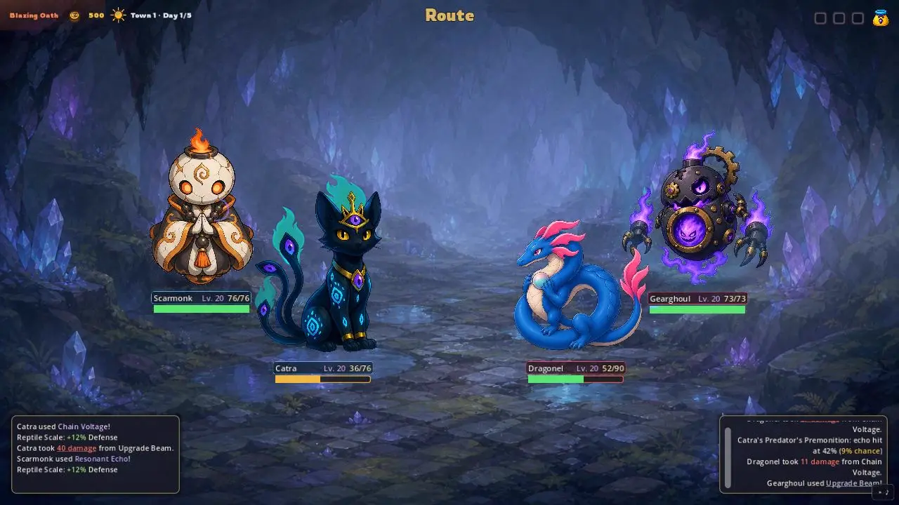
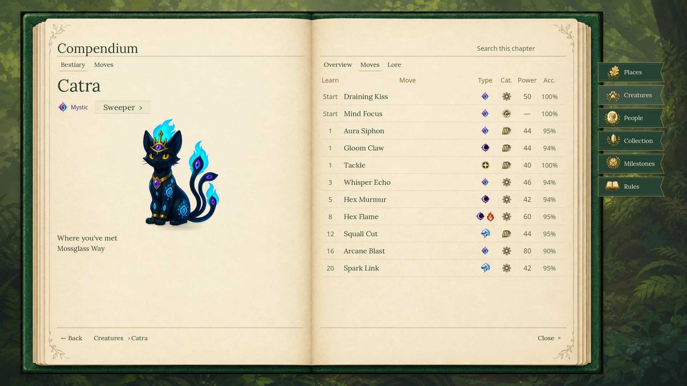

# Gojomons

Gojomons is a creature-building roguelike autobattler I am developing in Godot. Build a team, choose a route, combine moves with equipment, and find out whether the plan survives the next fight.

**[Visual showcase](https://slugonomics.xyz/gojomons/)** · **[Architecture](ARCHITECTURE.md)** · **[Balance study](METHODS.md)**



Runs move through towns, routes, dungeons and bosses. Creature families, moves, held items and team relics create builds that can behave very differently even when their basic stats look similar.

## Design idea → system problem

| I wanted… | That required… |
| --- | --- |
| Mechanics that combine in surprising ways | A shared event vocabulary, with one authoritative resolver for ordered combat changes |
| A large roster that remains understandable | A searchable Living Game Bible built from the game data: creatures, moves, items, relics, masters and balance records |
| Faster iteration without guessing | Encounter fixtures, contextual review tools and seeded simulations using the same rules as live combat |

The architecture changed as the game grew. Signals reduced dependencies between campaign, interface and diagnostic systems. State-changing combat later moved into one direct `CombatResolver`, preventing effects from firing twice and keeping live battles aligned with headless simulation. [The architecture note](ARCHITECTURE.md) explains that boundary.



The Living Game Bible turns the project’s content into a browsable reference instead of a collection of disconnected data files. It is designed to be rebuilt as the game changes, so the same structure supports design review, balance work and the player-facing Compendium.

## Does one type need stronger stats?

Dual typing gives a creature more possible strengths, weaknesses and interactions. Single-type creatures therefore receive a 7% stat allowance in the current rules. I used the shared simulator to test whether that compensation should change rather than adjusting it by feel. Seven multipliers were compared across 41 single-type and 61 dual-type species.

Training selected **1.00×**, keeping the current stats. On 1,024 fresh matchup-and-seed pairs—2,048 battles after exchanging sides—single-type creatures scored **49.7%**, with a **47.2–52.3%** paired-bootstrap interval. For this roster and ruleset, the current group-level allowance is already close to parity.

[Methods, controls and interpretation](METHODS.md) · [Recorded results](data/balance-summary.json) · [Provenance](PROVENANCE.md)

```sh
python experiments/analyze_balance.py
python -m unittest discover -s tests
```

The included data reproduces the reported selection, totals and interval. New battles require the private game source. Gojomons remains in active development; this repository is a selected technical record rather than a playable release.
