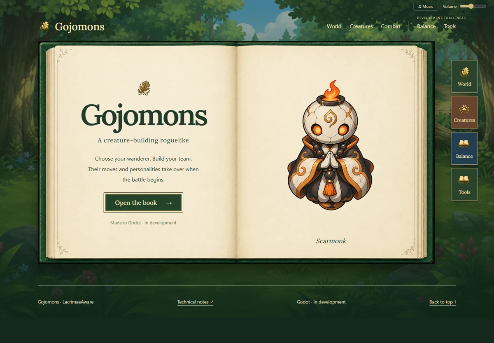

[](https://lacrimaeaware.github.io/gojomons-portfolio/)

Gojomons is a creature-building roguelike autobattler I am developing in Godot. Build a team, choose a route, combine moves with equipment, and find out whether the plan survives the next fight.

## Explore the visual showcase

[](https://lacrimaeaware.github.io/gojomons-portfolio/)

**[Open the book →](https://lacrimaeaware.github.io/gojomons-portfolio/)** Game footage introduces the world and combat. The Balance and Tools chapters show how I test mechanics, inspect simulations and review changes in playable scenes.

## Managing complexity and its consequences

Moves, creature abilities, held items and team relics can all react during the same fight. Those interactions make builds interesting, but they also make bugs and dominant strategies harder to spot. I use shared combat rules, automated opponents and repeatable playtests to examine what happens when the systems meet.

| Development question | How I investigate it |
| --- | --- |
| How can effects interact without firing twice or in the wrong order? | One combat resolver owns the state changes; signals let presentation and diagnostic systems respond. **[Architecture →](ARCHITECTURE.md)** |
| Which choices reward a stronger strategy, and which are broadly overpowered? | Compare simulated outcomes under different decision policies, then inspect species and matchup patterns. **[Balance showcase →](https://lacrimaeaware.github.io/gojomons-portfolio/balance/)** |
| How can I check a change quickly in its actual context? | Launch specific encounters, inspect the scene and attach review notes. **[Development tools →](https://lacrimaeaware.github.io/gojomons-portfolio/tools/)** |

### From balance question to a tested decision

Balance should leave players with worthwhile alternatives. One example is the tradeoff between single-type and dual-type creatures: a second type adds matchup options and weaknesses, so equal base stats need not produce equally useful choices.

Gojomons already gives single-type creatures a **7% stat allowance**. I tested whether that allowance needed changing: seven adjustments, the same training matchups, then a separate set of fresh matchups to check the selected setting.

| Experiment | Result |
| --- | --- |
| Roster | 41 single-type and 61 dual-type species |
| Selected adjustment | **Keep current stats** (1.00×, retaining the existing allowance) |
| Fresh-matchup score | **49.7%** for single-type creatures |
| 95% paired-bootstrap interval | **47.2–52.3%**, from 1,024 paired scenarios / 2,048 battles |

The group average supports keeping the allowance in this test. Species-level matchups and equipment synergies are further questions—the [interactive balance chapter](https://lacrimaeaware.github.io/gojomons-portfolio/balance/) shows how I examine them.

**[Read the experiment →](METHODS.md)** for the controls, selection procedure and uncertainty. **[Source and media notes →](PROVENANCE.md)** identify the recorded data and footage.

<details>
<summary>Reproduce the recorded analysis</summary>

```sh
python experiments/analyze_balance.py
python -m unittest discover -s tests
```

The included outcomes reproduce the selection, totals and interval. Running new battles requires the private game source.

</details>
